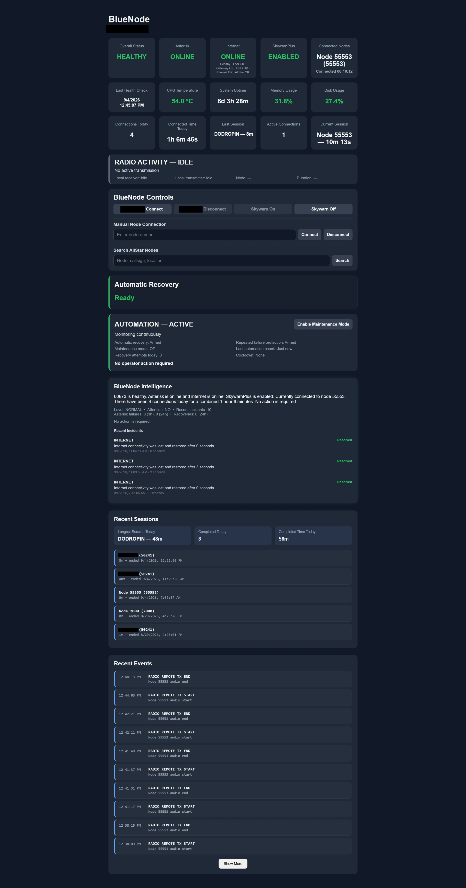

# BlueNode

BlueNode is an open-source monitoring, control, intelligence, and automatic-recovery dashboard for AllStarLink v3 nodes.

**Status:** v0.1.0-alpha — early public testing release.
## Dashboard


## Features

- Live AllStar, Asterisk, Internet, CPU, memory, disk, and uptime monitoring
- HEALTHY / DEGRADED / FAULT health states
- Connection/session tracking with friendly node names
- Live local RX, node PTT, and keyed AllStar-link activity telemetry
- Cached callsign and registered-location enrichment for active remote nodes
- Cached layered diagnostics for LAN, gateway, DNS, Internet, and AllStar connectivity
- Manual connect/disconnect controls
- Optional DODROPIN and SkywarnPlus controls
- Event logging and incident correlation
- BlueNode Intelligence summaries and recommendations
- Automatic Asterisk recovery with verification, cooldown, and lockout protection
- Automated Operations status, persistent Maintenance Mode, and repeated-failure backoff
- Desktop/mobile web dashboard
- systemd startup and installer support
- Python standard library only

## Requirements

AllStarLink v3, Python 3, Asterisk with `rpt`, systemd, sudo, and a Linux service user. SkywarnPlus is optional.

## Install

```bash
sudo ./install/install.sh
```

On a first install, edit:

```text
/opt/nodesmart/config/nodesmart.json
```

Then rerun the installer.

The dashboard defaults to:

```text
http://NODE_IP:8080/web/
```

See `docs/INSTALL.md` and `docs/CONFIGURATION.md`.

For the guarded Windows-to-node deployment workflow, see
`docs/DEPLOYMENT.md`.
It documents the canonical identity check, `git push origin main`, and the
single-command deployment/live-verification path for routine changes.

Optional authenticated remote access is disabled by default. Its preparation,
security model, direct Apache mode, and provider-neutral tunnel guidance are in
`docs/REMOTE_ACCESS.md`.

## Security

BlueNode installs a project-specific sudoers file rather than requiring blanket passwordless root access. The alpha privilege model may be tightened further in future releases.

The dashboard does not provide native Internet-facing authentication. Keep it
on a trusted network unless the optional authenticated HTTPS framework has been
deliberately configured and enabled.

## Optional integrations

Skywarn controls require an existing SkywarnPlus installation at `/usr/local/bin/SkywarnPlus/`.

Friendly node controls can be configured using entries in friendly_nodes.

## Project layout

```text
config/   Example configuration
core/     Monitoring, health, intelligence, recovery, web backend
docs/     Installation and configuration documentation
install/  Installer, helpers, sudoers template
systemd/  Service template
web/      Dashboard
```

Runtime directories (`events/`, `history/`, `logs/`, `state/`) and the live `config/nodesmart.json` are ignored by Git.

## Alpha notice

This is an alpha release. Test it on a node you can access directly before relying on automatic recovery or remote controls.

## Author

BlueNode was originally created and developed by **BlueKF0OZX**.

## License

MIT. See `LICENSE`.
