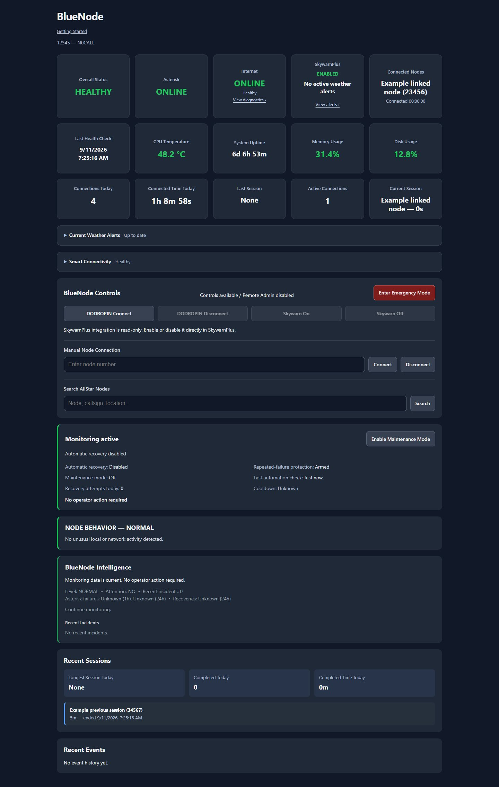

# BlueNode

BlueNode is an open-source monitoring, control, intelligence, and automatic-recovery dashboard for AllStarLink v3 nodes.

**Status:** 0.1.2-alpha.0 - unreleased development snapshot for early testing.
See [validation status](docs/VALIDATION_STATUS.md) for completed lab checks and
remaining limits before choosing a version to evaluate.
## Dashboard



Current dashboard with synthetic example observations. See [Testing](docs/TESTING.md) and [radio-origin limits](docs/TX_ORIGIN.md).
## Features

- Live AllStar, Asterisk, Internet, CPU, memory, disk, and uptime monitoring
- HEALTHY / DEGRADED / FAULT health states
- Connection/session tracking with friendly node names
- Passive backend local-RF and adjacent-peer telemetry with explicit attribution limits
- Cached callsign and registered-location enrichment for active remote nodes
- Cached layered diagnostics for LAN, gateway, DNS, Internet, and AllStar connectivity
- Manual connect/disconnect controls
- Optional DODROPIN controls and read-only SkywarnPlus observations
- Event logging and incident correlation
- BlueNode Intelligence summaries and recommendations
- Automatic Asterisk recovery with verification, cooldown, and lockout protection
- Automated Operations status, persistent Maintenance Mode, and repeated-failure backoff
- Deliberate persistent Emergency Mode for high-attention operational views
- Passive Node Behavior and Network Courtesy monitoring with conservative operator-review thresholds
- Desktop/mobile web dashboard
- Preview and download a privacy-filtered [troubleshooting report](docs/TROUBLESHOOTING_REPORT.md)
- systemd startup and installer support
- Python standard library only

## Requirements

AllStarLink v3 (Debian/systemd), Python 3.11 or newer, Asterisk with `rpt`, systemd, sudo, and a Linux service user. SkywarnPlus is optional.

## Install

Start from the public checkout on a working ASL3 node:

```bash
sudo apt-get update
sudo apt-get install git python3 sudo iproute2 iputils-ping curl nano
git clone https://github.com/BlueKF0OZX/BlueNode.git
cd BlueNode
sudo useradd --system --user-group --home-dir /opt/nodesmart --no-create-home --shell /usr/sbin/nologin bluenode
sudo NODESMART_USER=bluenode bash ./install/install.sh
```

The first run creates configuration and stops. Edit it with
`sudo nano /opt/nodesmart/config/nodesmart.json`, set your node number and
callsign, then rerun the installer with the same `NODESMART_USER`.

New installs listen on **127.0.0.1:8080** and leave automatic Asterisk recovery
**disabled**. Choose a trusted LAN IPv4 listener deliberately, or use an SSH
local forward. The installer does not change firewall/network settings or
Asterisk/radio configuration and does not restart Asterisk.

Follow [Installation](docs/INSTALL.md) for dashboard access, prerequisites,
verification, optional integrations, updates, recovery, and troubleshooting.
See [Configuration](docs/CONFIGURATION.md) for operator settings.

See [Upgrade and rollback](docs/UPGRADE.md) before updating an existing node.
The separate [maintainer deployment workflow](docs/DEPLOYMENT.md) requires an existing installed Git checkout.

Optional authenticated remote access is disabled by default. Its preparation,
security model, direct Apache mode, and provider-neutral tunnel guidance are in
`docs/REMOTE_ACCESS.md`.

Optional application-level Remote Admin is also disabled by default. It adds
expiring sessions, CSRF protection, fixed action/log allowlists, and a minimal
audit trail without exposing shell access. See `docs/REMOTE_ADMIN.md` for the
security model and safe initialization procedure.

Soft Radio is parked/disabled pending a verified read-only audio tap.
`docs/SOFT_RADIO_RX.md` records the experimental design and safety gates; it is
not part of new-user installation. Net Mode/NetMap remain deferred.

Emergency Mode reprioritizes existing health, connectivity, Skywarn, connected
node, Intelligence, incident, recovery, and event information without changing
radio or recovery behavior. See `docs/EMERGENCY_MODE.md`.

Node Behavior monitoring passively analyzes bounded recent telemetry for link
churn, unconfirmed connection attempts, extended or rapidly cycling local COR,
frequent controls, and repeated BlueNode recovery activity. It never performs
corrective actions. See `docs/NODE_BEHAVIOR.md`.

## Security

BlueNode installs a project-specific sudoers file with a root-owned command
broker, fixed helpers, and an exact restart permission. Services run as an
unprivileged account; application code is root-owned.

Authentication is disabled on a default installation. Keep the dashboard on
loopback or a trusted network. Remote access requires deliberately configured
authenticated HTTPS and application-level Remote Admin; see the linked guides.

## Optional integrations

SkywarnPlus observations require an existing installation at `/usr/local/bin/SkywarnPlus/`. BlueNode does not enable, disable, or execute SkywarnPlus.
Current Weather Alerts use an optional, version-checked observer of SkywarnPlus's
existing collection cycle. See [Weather Alerts](docs/WEATHER_ALERTS.md) for the
explicit installation check, freshness rules and update compatibility. Without
the observer, alert telemetry is unavailable. Manage SkywarnPlus directly through its own tools.

The example friendly_nodes mapping includes 50241 to DODROPIN. Existing operator mappings are preserved. Node controls verify fresh App_Rpt state; unavailable observations do not count as successful connections. Manual controls do not depend on the online node directory.

## Project layout

```text
config/   Example configuration
core/     Monitoring, health, intelligence, recovery, web backend
docs/     Installation and configuration documentation
install/  Installer, helpers, sudoers template
systemd/  Service template
web/      Dashboard
```

Runtime directories (`events/`, `history/`, `logs/`, `state/`) and the live `config/nodesmart.json` are ignored by Git.

## Alpha notice

This is an alpha release. Test it on a node you can access directly before relying on automatic recovery or remote controls.

For an initial evaluation, follow the [early testing guide](docs/EARLY_TESTING.md).

## Author

BlueNode was originally created and developed by **BlueKF0OZX**.

## License

MIT. See `LICENSE`.
