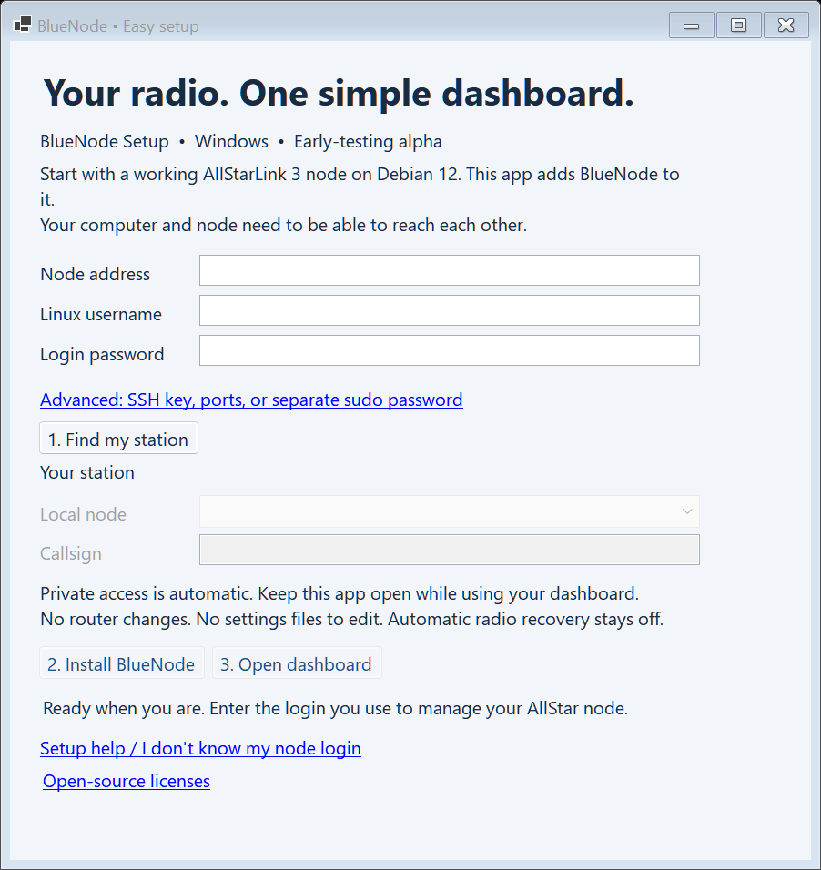

# BlueNode in three buttons

**[Download BlueNode Setup for Windows](https://github.com/BlueKF0OZX/BlueNode/releases/download/v0.1.3-alpha.1/BlueNode-Setup.exe)**

You need a Windows x64 computer and a **working AllStarLink 3 node on Debian 12**.
Your computer must be able to reach that node over SSH, and its Linux login must
have sudo access. BlueNode does not install ASL3 or configure the radio itself.
For a blank Pi, start with the [AllStarLink guide](https://allstarlink.github.io/install/).

## 1. Find my station

Open the downloaded **BlueNode-Setup.exe**. There is no Windows installation
wizard and no separate runtime to install.

Enter your node's **address**, **Linux username**, and **login password**. Click
**Find my station**. On the first connection, the app asks you to recognize the
node's SSH identity. If someone else manages the node, ask them to verify it.

These are the same details used to manage ASL3. They are **not** your callsign,
AllStar website login, or node registration password. Your node's address may
be shown in your router's connected-device list or ASL3 setup notes. If someone
built your node, ask them for the SSH address and Linux login. The app cannot
recover a forgotten password.

Advanced options support a different SSH port, a private key, or a separate
sudo password. With a key selected, the login-password box takes its passphrase.

## 2. Install BlueNode

Confirm the detected **local node** and **callsign**, click **Install BlueNode**,
and confirm the summary. With multiple local nodes, choose the one to monitor.

The app installs its bundled release and checks that the dashboard can observe
your station. It creates a dedicated BlueNode service account. Asterisk keeps
running, its configuration is preserved, and automatic recovery stays off.

If the connection drops, reopen the app and click **Find my station** again.
Installation continues on the node, and the app checks its progress. A failed
fresh install removes the incomplete BlueNode installation and keeps a private
log on the node. Existing/custom files are never overwritten by fresh setup.

Already have BlueNode? The app checks it and enables **Open dashboard**, without
reinstalling or replacing your settings. Updates still use the explicit,
backed-up [guided update workflow](GET_STARTED.md#already-installed).

## 3. Open dashboard

Click **Open dashboard**. It opens in your normal browser. **Keep BlueNode Setup
open while using it**: the app maintains the private SSH connection. Closing the
app closes that connection; BlueNode and your radio keep running on the node.

Next time, open the app, sign in, and click **Open dashboard**. Your computer
remembers the address, username, SSH port, and approved SSH fingerprint.
**Passwords and private keys are not copied to the settings file.**

Use the app's button each time; the temporary browser address may change. This
private connection is for this computer. Phone/LAN access is an optional separate
configuration; the Windows installer does not open a public dashboard port.

## If you get stuck

| Message or situation | What to do |
| --- | --- |
| Windows shows an unknown publisher | This alpha is not code-signed. Download only from the linked BlueNode release. Follow your computer's security policy; don't disable antivirus or SmartScreen. Source and a checksum are available on the release page. |
| Cannot reach node | Check its address/SSH port, power, and network connection. |
| Login not accepted | Use the Linux login used to manage ASL3; check spelling and keyboard layout. |
| Sudo/Python check failed | The login needs sudo access and Python 3.11+. Ask the node administrator; Advanced accepts a separate sudo password. |
| Missing prerequisite | Use the [terminal setup](GET_STARTED.md), which can install the prerequisite packages, or ask your node administrator. |
| Port unavailable | Under Advanced, choose another dashboard port, such as 8082. |
| SSH identity changed | Stop and verify the node. If intentionally rebuilt, close the app and remove its saved settings file below, then verify the new fingerprint on reconnect. |
| Existing installation/helper conflict | The app preserves it. Use the [upgrade guide](UPGRADE.md) for manual/legacy installations. |
| Browser stops loading | Keep the app open. After network interruption, click Find my station, then Open dashboard again. |
| Setup interrupted on the node | A reboot/power loss differs from losing the Windows connection. Have the administrator inspect the private log shown by the app before retrying. |

Windows preferences are in `%LOCALAPPDATA%\BlueNode\setup.json`. They contain
connection details and fingerprints, not passwords. Removing that file also
removes remembered SSH identities. Setup jobs/logs remain private to root under
`/var/lib/bluenode-setup/jobs/`, and the underlying installer logs are under
`/var/log/bluenode-setup/`. An abrupt app exit can leave an unused
`/tmp/bluenode-desktop-*` upload. These uploads contain public release files,
not credentials. A node administrator can remove old uploads after setup ends.

This is an **early-testing alpha**, validated in a disposable ASL3 VM. See
[test details and limits](WINDOWS_SETUP_VALIDATION.md). It is not a replacement
for a backup of a customized radio node.
